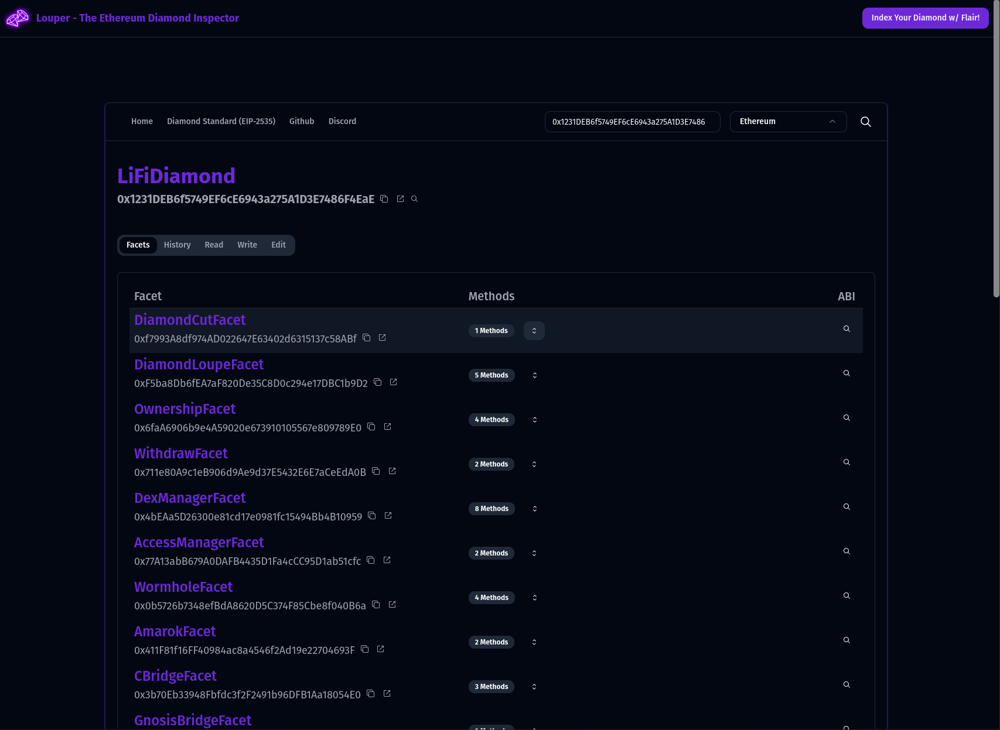

<br/>
<p align="center">
  <a href="https://github.com/mark3labs/louper-v3">
    
  </a>

  <h3 align="center">Louper</h3>

  <p align="center">
    The Ethereum Diamond Inspector
    <br/>
    <a href="https://louper.dev">View Demo</a>
    .
    <a href="https://github.com/mark3labs/louper-v3/issues">Report Bug</a>
    .
    <a href="https://github.com/mark3labs/louper-v3/issues">Request Feature</a>
  </p>
</p>

    

## Table Of Contents

- [About the Project](#about-the-project)
- [Built With](#built-with)
- [Getting Started](#getting-started)
  - [Prerequisites](#prerequisites)
  - [Installation](#installation)
- [Usage](#usage)
- [Contributing](#contributing)
- [License](#license)
- [Authors](#authors)
- [Acknowledgements](#acknowledgements)

## About The Project



# Louper

Louper is an innovative open-source tool designed to inspect EIP-2535 Diamond proxy contracts on EVM (Ethereum Virtual Machine) compatible blockchains. EIP-2535 Diamonds is an advanced smart contract specification that provides a powerful approach for creating upgradable and scalable smart contracts. Louper aims to provide a comprehensive and easy-to-use interface for interacting with these intricate and complex contract structures.

## Key Features

- **View Verified Facets**: Essential for analyzing the composition and structure of an implemented Diamond, Louper allows you to view the verified facets of any EIP-2535 Diamond. Obtain real-time visibility into the facets that form the Diamond and understand their individual functionality.

- **Read-Only Function Calls**: Read a diamond contract's state directly through their exposed functions. Louper enables you to call read-only functions from the diamond contract context for easy and non-intrusive exploration of the contract's current state.

- **Execute Writable Functions**: Go beyond just viewing and interact with the contract in more impactful ways. Louper provides an interface to execute writable functions from the diamond contract context, enabling state-changing operations.

- **Facet Management**: Stay flexible and adaptable to evolving requirements with Louper. You can add, replace or remove facets from an existing diamond contract, providing a significantly easy and straightforward approach to manage and manipulate the design and functionality of the diamond contracts.

Louper is a tremendously valuable tool for Ethereum developers and enthusiasts aiming to leverage the power of the EIP-2535 Diamond Standard. Whether you are a novice engineer trying to understand more about the inner workings of diamond contracts or an experienced blockchain developer looking to reduce the complexity of managing diamond contracts, Louper could be the tool you need.

Start using Louper today and bring clarity, simplicity and adaptability to your EIP-2535 Diamond proxy contracts.

## Built With

Louper owes its existence and functionality to several outstanding open source libraries and tools. These include:

- [Sveltekit](https://kit.svelte.dev)
- [Bun](https://bun.sh)
- [Docker](https://docker.io)
- [Wagmi](https://wagmi.sh)
- [Viem](https://viem.sh)
- [Drizzle ORM](https://orm.drizzle.team)

## Getting Started

To get a local copy up and running follow these simple example steps.

### Prerequisites

- bun

```sh
curl -fsSL https://bun.sh/install | bash
```

### Installation

1. Clone the repo

```sh
git clone https://github.com/mark3labs/louper-v3.git
```

2. Change directories

```sh
cd louper-v3
```

3. Install dependencies

```sh
bun install
```

4. Run DB migrations

```sh
bun ./scripts/migrate.ts
```

5. Start the dev server

```sh
bun --bun --hot-dev
```

## Usage

You can view your local instance by pointing your browser to:
http://localhost:5173

## Run locally with Docker

You can also run Louper locally using Docker. To do so, follow these steps:

```sh
docker run --rm -it -p 3000:3000 mark3labs/louper-web
```

## Contributing

Contributions are what make the open source community such an amazing place to be learn, inspire, and create. Any contributions you make are **greatly appreciated**.

- If you have suggestions for adding or removing projects, feel free to [open an issue](https://github.com/mark3labs/louper-v3/issues/new) to discuss it, or directly create a pull request after you edit the _README.md_ file with necessary changes.
- Please make sure you check your spelling and grammar.
- Create individual PR for each suggestion.

### Creating A Pull Request

1. Fork the Project
2. Check out the `dev` branch (`git checkout dev`)
3. Create your Feature Branch (`git checkout -b feature/AmazingFeature`)
4. Commit your Changes (`git commit -m 'Add some AmazingFeature'`)
5. Push to the Branch (`git push origin feature/AmazingFeature`)
6. Open a Pull Request

## License

Distributed under the MIT License. See [LICENSE](https://github.com/mark3labs/louper-v3/blob/main/LICENSE.md) for more information.

## Authors

- **Ed Zynda** - _Software Engineer_ - [Ed Zynda](https://twitter.com/what_the_func) - _Louper Creator_

## Acknowledgements

- [Nick Mudge (EIP-2535 Creator)](https://twitter.com/mudgen)
