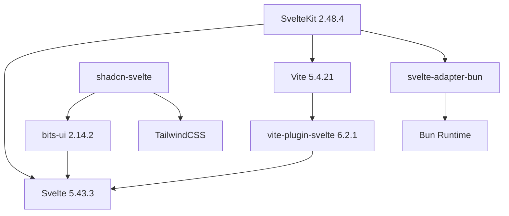
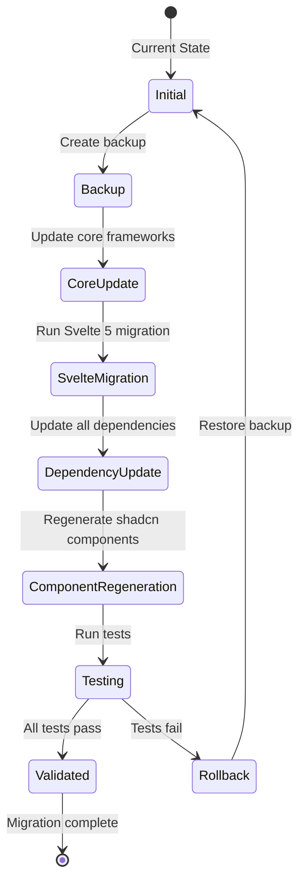

# Data Model: Framework and Dependency Upgrade

**Generated**: 2025-11-06  
**Feature**: 001-upgrade-dependencies  
**Type**: Configuration and Dependency Management

## Overview

This feature involves upgrading framework dependencies rather than introducing new data entities. The data model consists primarily of configuration files and dependency specifications that control the application's build and runtime behavior.

## Configuration Entities

### PackageConfiguration
**Location**: `/package.json`  
**Purpose**: Defines all project dependencies and their versions

#### Fields
| Field | Type | Description | Validation |
|-------|------|-------------|------------|
| dependencies | Object<string, string> | Runtime dependencies | Valid semver ranges |
| devDependencies | Object<string, string> | Development dependencies | Valid semver ranges |
| scripts | Object<string, string> | Bun run scripts | Valid shell commands |
| type | string | Module type | Must be "module" |
| trustedDependencies | string[] | Bun trusted packages | Valid package names |

#### State Transitions
- **Current State**: Svelte 4 + outdated dependencies
- **Upgrading State**: Dependencies being updated
- **Migrated State**: Svelte 5 + latest dependencies
- **Validated State**: All tests passing

### ComponentConfiguration
**Location**: `/components.json`  
**Purpose**: Controls shadcn-svelte component generation

#### Fields
| Field | Type | Description | Validation |
|-------|------|-------------|------------|
| $schema | string | Schema URL | Valid URL |
| style | string | Component style preset | "default" \| "new-york" |
| tailwind.css | string | CSS file path | Valid file path |
| tailwind.baseColor | string | Base color scheme | Valid color name |
| aliases | Object<string, string> | Path aliases | Valid path mappings |
| registry | string | Component registry URL | Valid URL |

#### Relationships
- References file paths in project structure
- Controls component generation in `src/lib/components/ui/`

### BuildConfiguration
**Location**: `/vite.config.ts`  
**Purpose**: Vite build tool configuration

#### Fields
| Field | Type | Description | Validation |
|-------|------|-------------|------------|
| plugins | Array | Vite plugins | Valid plugin instances |
| resolve.alias | Object | Path resolution | Valid path mappings |
| server | Object | Dev server config | Valid server options |
| build | Object | Build options | Valid build config |

#### Dependencies
- Must be compatible with SvelteKit version
- Plugin versions must match Vite version

### SvelteConfiguration
**Location**: `/svelte.config.js`  
**Purpose**: SvelteKit framework configuration

#### Fields
| Field | Type | Description | Validation |
|-------|------|-------------|------------|
| preprocess | Array\|Object | Preprocessors | Valid preprocessor config |
| kit.adapter | Object | Deployment adapter | Valid adapter instance |
| kit.alias | Object | Path aliases | Must match tsconfig paths |
| compilerOptions | Object | Svelte compiler options | Valid compiler flags |

#### Relationships
- Adapter must be compatible with Bun runtime
- Preprocessors must support Svelte 5 syntax

### TypeScriptConfiguration
**Location**: `/tsconfig.json`  
**Purpose**: TypeScript compiler configuration

#### Fields
| Field | Type | Description | Validation |
|-------|------|-------------|------------|
| compilerOptions.target | string | ECMAScript target | ES2017 or higher |
| compilerOptions.module | string | Module system | "ESNext" for Vite |
| compilerOptions.paths | Object | Path mappings | Must match SvelteKit aliases |
| extends | string | Base configuration | Valid config path |

## Dependency Relationships

### Framework Stack Dependencies

### Version Compatibility Matrix
| Component | Min Version | Max Version | Required By |
|-----------|------------|-------------|-------------|
| Svelte | 5.0.0 | 5.x.x | SvelteKit 2.48+, bits-ui 2.x |
| SvelteKit | 2.48.0 | 2.x.x | Svelte 5 support |
| Vite | 5.0.0 | 5.4.x | SvelteKit 2.x |
| bits-ui | 2.0.0 | 2.x.x | Svelte 5, shadcn-svelte |
| TypeScript | 5.0.0 | 5.x.x | Svelte 5 type support |

## Migration State Management

### Migration Phases

### File Change Tracking
| File Pattern | Change Type | Migration Tool |
|--------------|-------------|----------------|
| `*.svelte` | Syntax update | `bun x sv migrate svelte-5` |
| `package.json` | Version updates | Manual edit |
| `components.json` | Schema update | Manual edit |
| `src/lib/components/ui/*` | Full replacement | `bun x shadcn-svelte@latest add --overwrite` |
| Import statements | Package name changes | Find/replace |

## Validation Rules

### Dependency Version Validation
1. **Semver Compliance**: All versions must use valid semver ranges
2. **Compatibility Check**: Dependencies must be compatible within major versions
3. **Bun Support**: All packages must be Bun-compatible
4. **Security**: No known vulnerabilities in dependency tree

### Configuration Validation
1. **Path Existence**: All referenced paths must exist
2. **Alias Consistency**: Path aliases must match across configs
3. **Plugin Compatibility**: Vite plugins must support current Vite version
4. **TypeScript Strict**: Strict mode must remain enabled

### Runtime Validation
1. **Build Success**: `bun --bun run build` must complete
2. **Type Check**: `bun run check` must pass
3. **Dev Server**: `bun --bun run dev` must start
4. **No Console Errors**: Browser console must be error-free

## Side Effects and Impacts

### Code Changes Required
- **Import Updates**: `lucide-svelte` → `@lucide/svelte`
- **Component Props**: Adapt to new bits-ui API
- **Event Handlers**: `on:click` → `onclick` in Svelte 5
- **Reactive Statements**: `$:` → `$derived`/`$effect`

### Build Process Changes
- **Faster Builds**: Vite 5.4 optimizations
- **Better HMR**: Improved hot module replacement
- **Type Safety**: Enhanced with Svelte 5

### Development Workflow Changes
- **New Syntax**: Team must learn Svelte 5 runes
- **Component Management**: Use shadcn-svelte CLI for updates
- **Debugging**: New Svelte 5 DevTools features

## Data Integrity Constraints

### Pre-Migration Checks
1. Git working directory must be clean
2. All tests must pass in current state
3. Backup of node_modules equivalent must exist
4. Database migrations must be up to date

### Post-Migration Validation
1. All routes must return 200 status
2. Component library must render correctly
3. Form submissions must work
4. API endpoints must respond correctly

### Rollback Criteria
1. Build failures after dependency update
2. Runtime errors in production build
3. Test coverage drops below threshold
4. Performance regression detected

## Monitoring and Metrics

### Build Metrics
- Build time (target: < current baseline)
- Bundle size (target: ≤ current size)
- Tree-shaking effectiveness

### Runtime Metrics
- Page load time
- Time to interactive
- Memory usage
- Component render performance

### Development Metrics
- HMR update speed
- Type check duration
- Test execution time

## Security Considerations

### Dependency Security
- All dependencies must pass security audit
- No deprecated packages in production
- Regular updates for security patches
- Use exact versions in production

### Configuration Security
- No sensitive data in configuration files
- Environment variables for secrets
- Secure defaults for all settings

## Conclusion

While this upgrade doesn't introduce new data entities, it fundamentally changes how existing components and configurations interact. The migration requires careful coordination of dependency versions and configuration updates to maintain system stability. The validation rules and state transitions ensure a safe migration path with rollback capabilities.